## Computer Vision for Engineers
This repo contains codes and results of all 7 assignments for this course. To view detailed results view the .pdf file inside specific folders. The course the following topics
1. Sensor Selection
2. Image Processing and Analysis
3. Motion Analyses
4. 3D Reconstruction 
5. Pointcloud Processing 
6. Feature Tracking 
8. Object Detection.

Some visual results of a few assignments

### 1. Psuedo Coloring

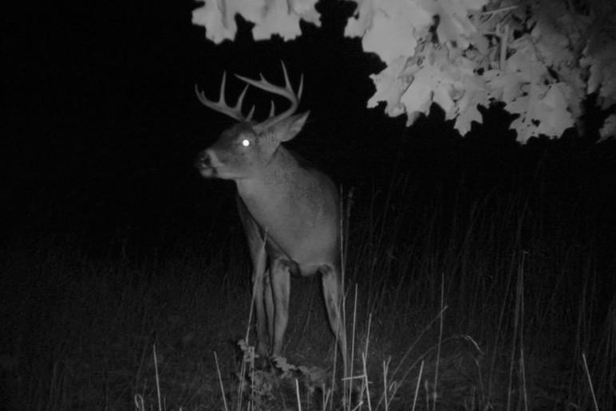
Original Image

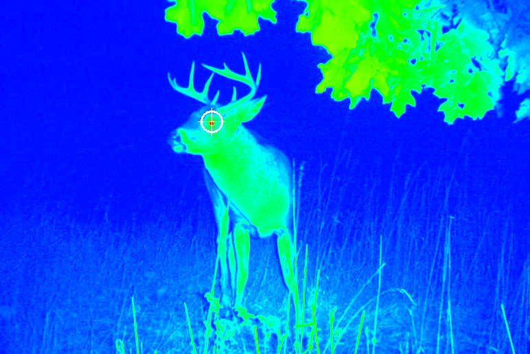

Psuedo colored Image

### 2. Image Stitching

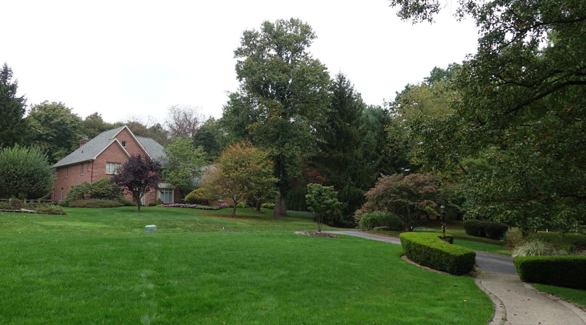
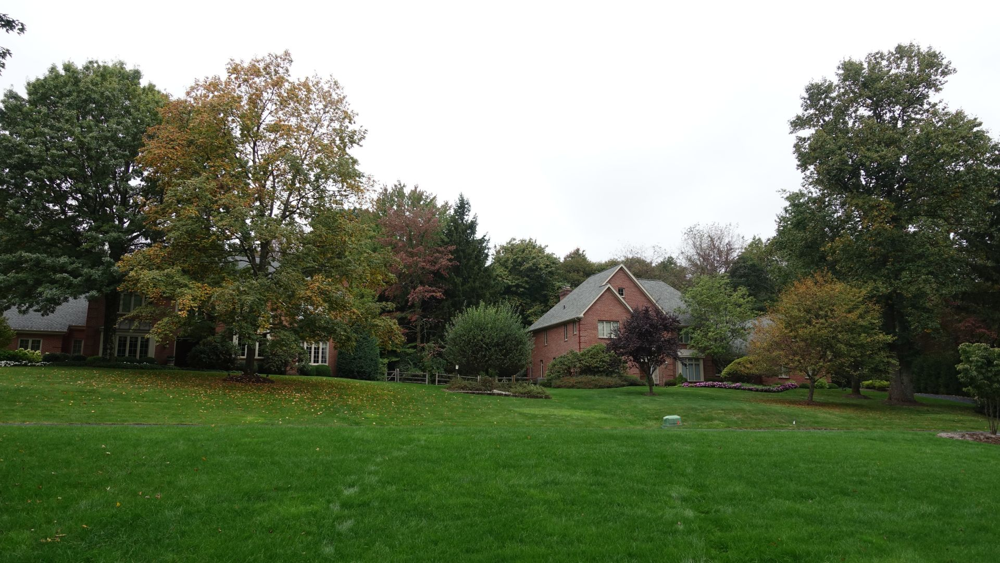
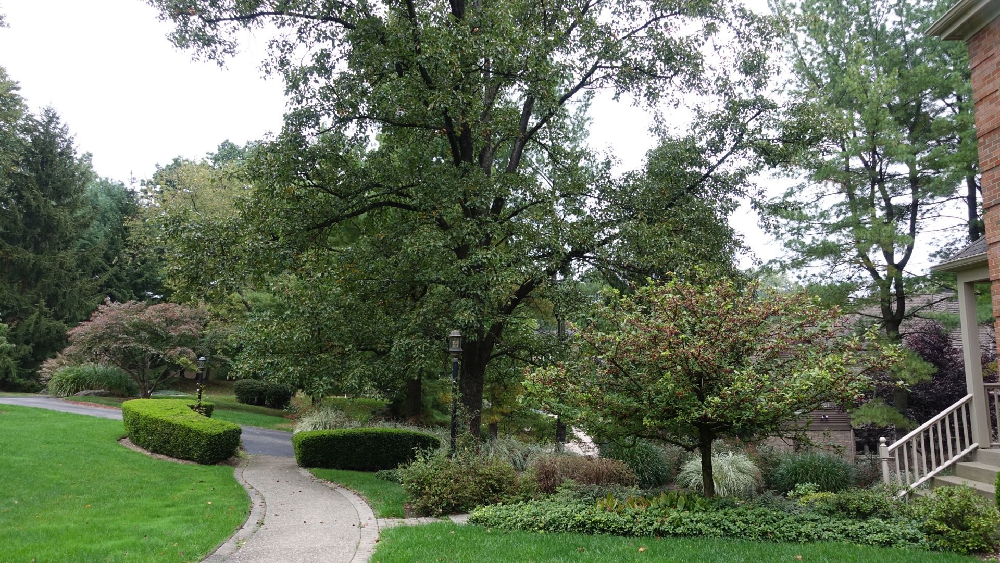
Center, Left, and Right Images

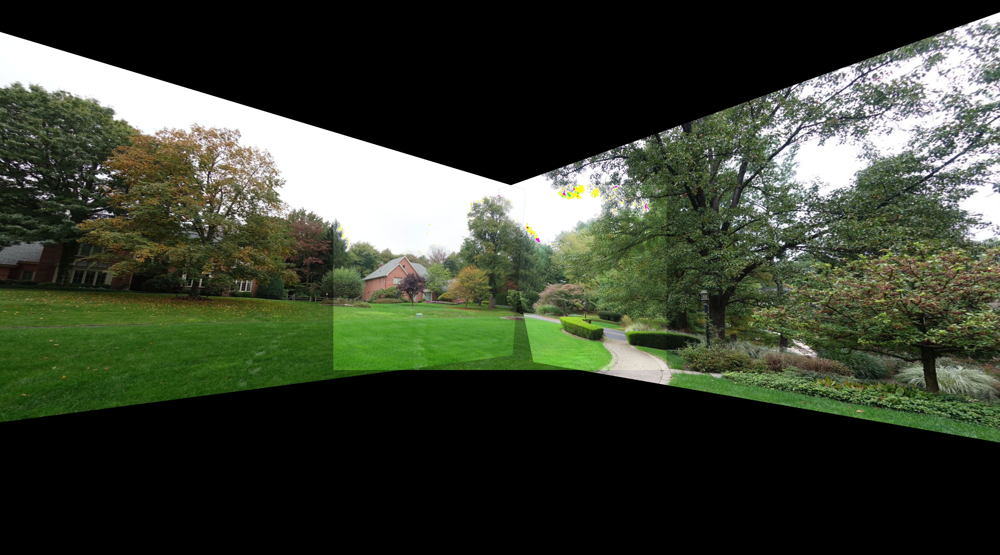

 Stitched

### 3. Binary image processing – detecting blobs, contours, and
central axes

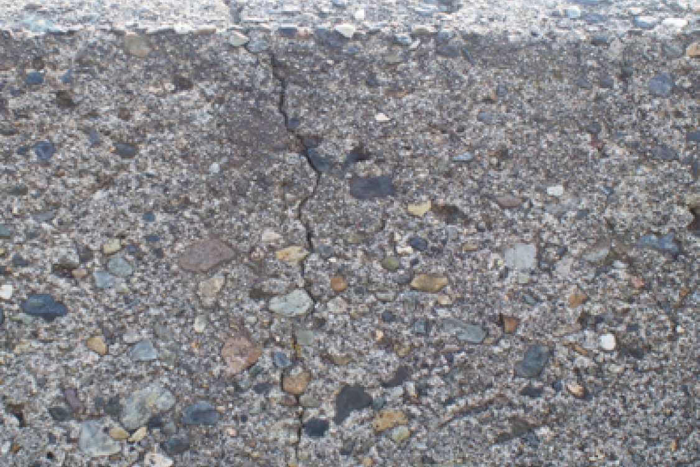
Original Image

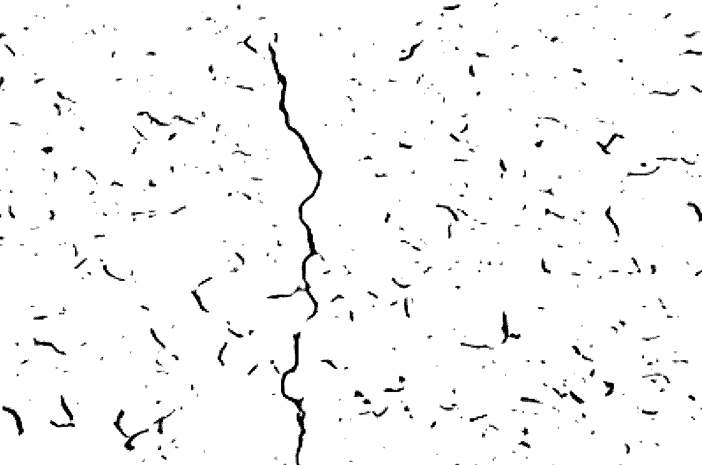

Output Image

### 4. Simple Stereo and 3D Reconstruction
central axes

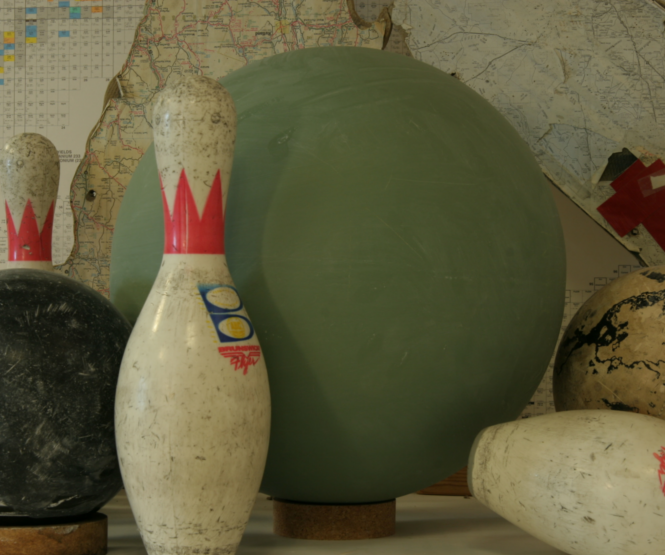
Left Image

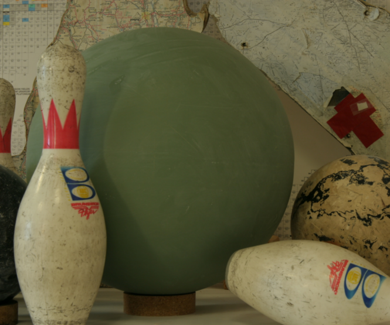
Right Image

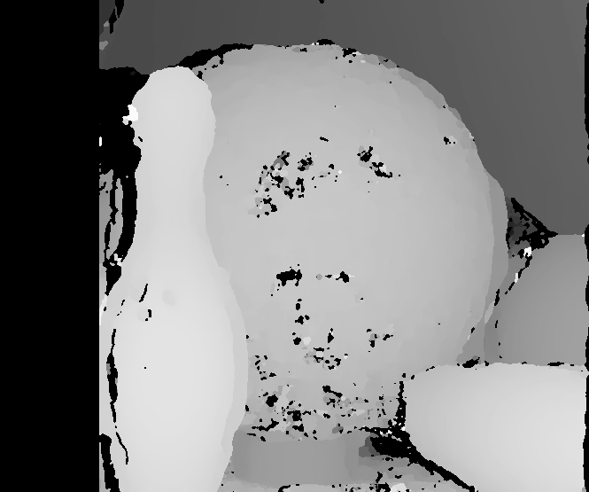
Disparity Image

