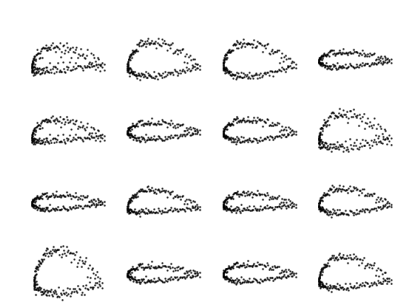

## Deep Learning for Engineers
This repo contains codes and results of all 4 assignments for this course. To view detailed results view the .pdf file inside specific folders. The course the following topics

1. Introduction to Deep Learning and its application
2. Neural Networks & Backpropagation
3. Convolutional Neural Networks (CNN)
4. Interpretability of Deep Learning
5. Graph Neural Networks (GNN)
6. Recurrent Neural Networks (RNN)
7. Variational Autoencoders (VAE) & Generative Adversarial
8. Networks (GAN)
9. Deep Reinforcement Learning (DRL)
10. Solving Engineering problems using Deep Learning

Some visual results of a few assignments

### 1. Loss decreasing for a neural network made from scratch using only NumPy library 

### 2. Flow estimation using LSTMs

### 3. Airfoil Synthesis using VAEs, and GANs
central axes

Results from Auto-Encoder

Results from VAE

Results from GAN

### 4. Reinforcement Learning

DDQN for balancing

