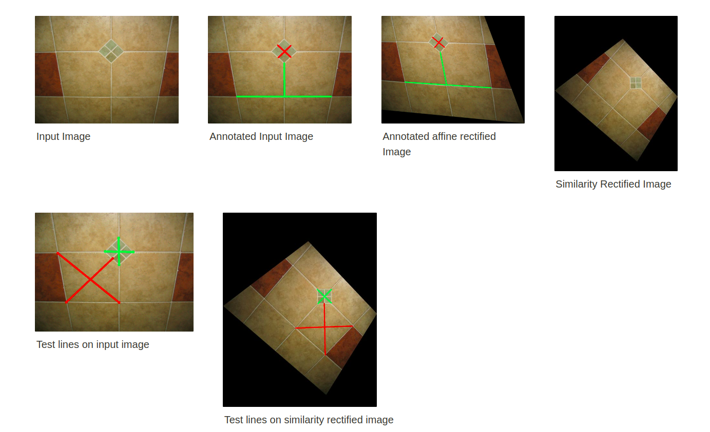
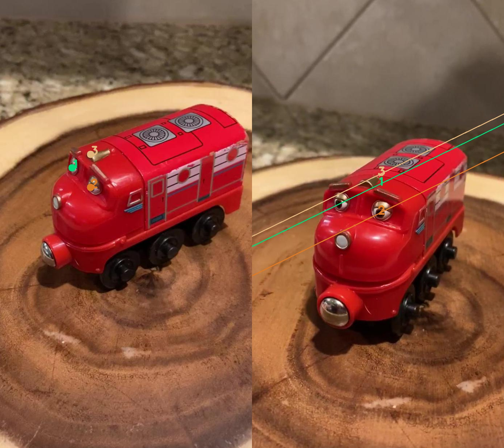
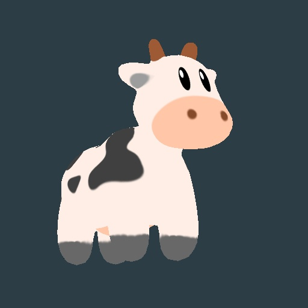
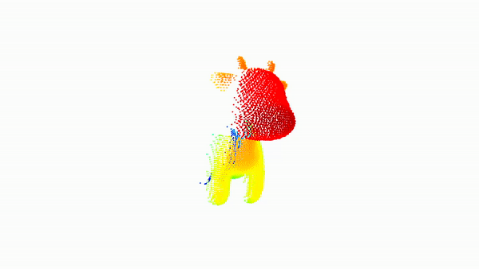

## Geometry Based Methods in Vision
This repo contains codes and results of all 4 assignments for this course. To view detailed results view the .pdf file inside specific folders. The course the following topics

Assignemnt list and links

1. Affine and Metric Rectification [link](https://www.notion.so/akshayantony/Assignment-1-16822-Akshay-Antony-fa746944a24546bf82f5c2b762be02aa)
2. Single View Reconstruction [link](https://akshayantony.notion.site/Assignment-2-16822-023ae77027e04149b7a1824f62e0c072)
3. Two View Geometry [link](https://www.notion.so/akshayantony/Assignment-3-5e6aac37157a44bb9c79e1acac0ddb2b)
4. Multi View Geometry [link](https://www.notion.so/akshayantony/Assignment-4-8dee1426f40345c080cdb3026cf25d1c)

Some visual results of a few assignments

### 1. Affine and Similarity Rectification [link](https://www.notion.so/akshayantony/Assignment-1-16822-Akshay-Antony-fa746944a24546bf82f5c2b762be02aa)

Step by step process of affine and metric rectification

### 2. Epipolar Geometry [link](https://www.notion.so/akshayantony/Assignment-3-5e6aac37157a44bb9c79e1acac0ddb2b)

Epipolar lines based on 7 point algorithm and RANSAC

### 3. Multi-View Reconstruction [link](https://www.notion.so/akshayantony/Assignment-4-8dee1426f40345c080cdb3026cf25d1c)

Input view 1

Input View 2

Input View 3

Input View 4

Reconstructed View

