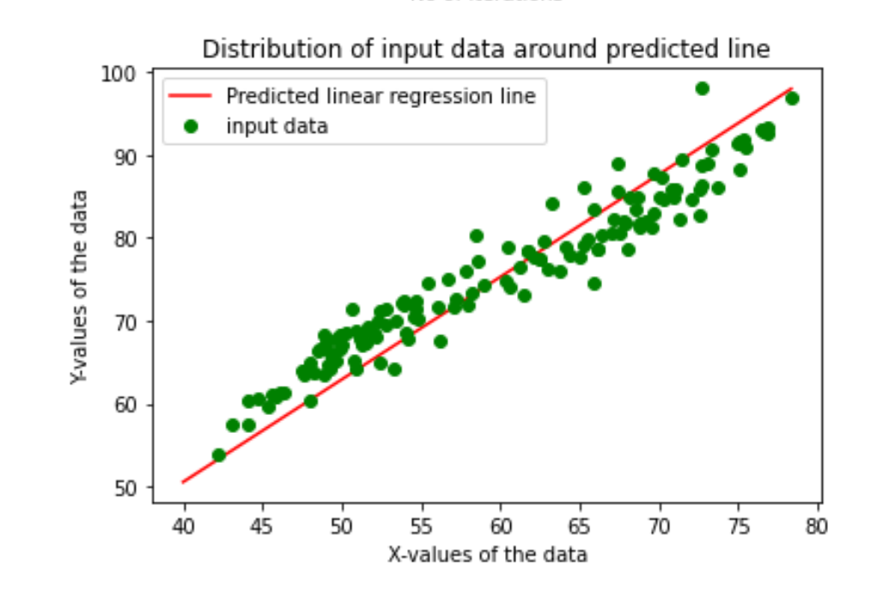
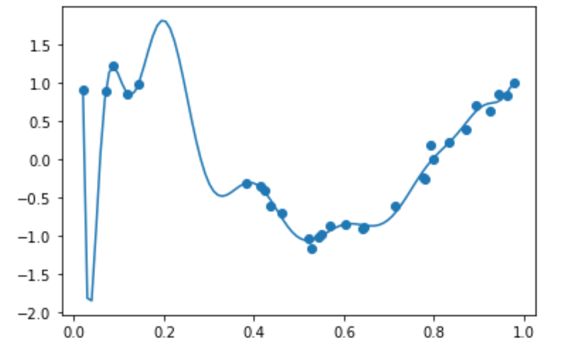
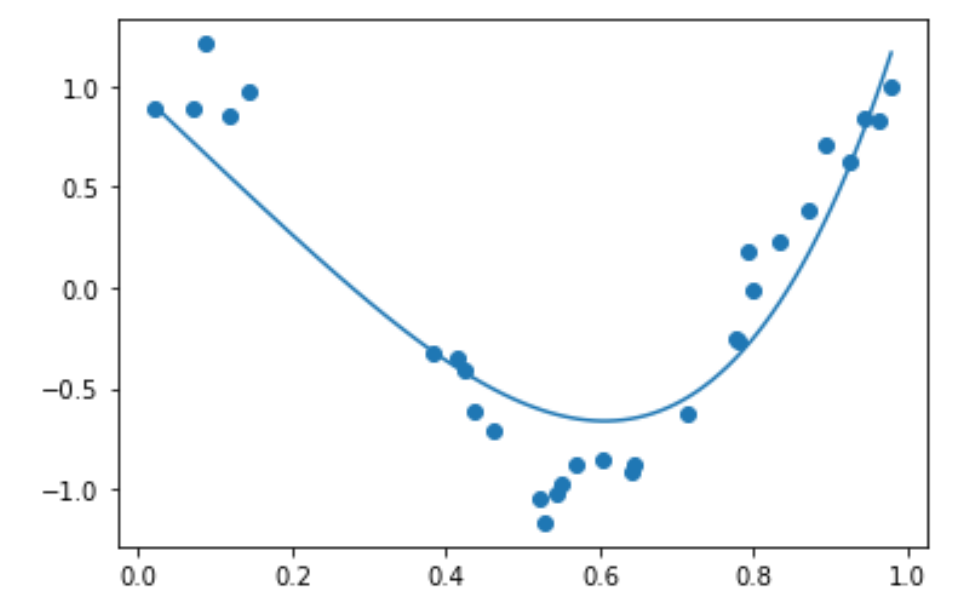
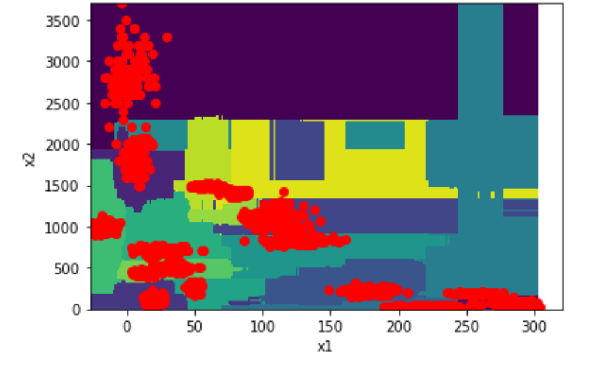
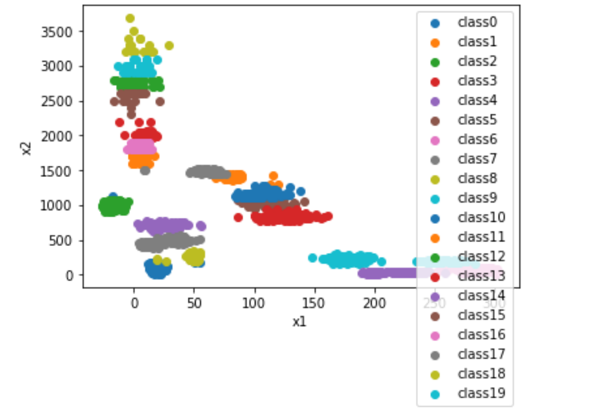
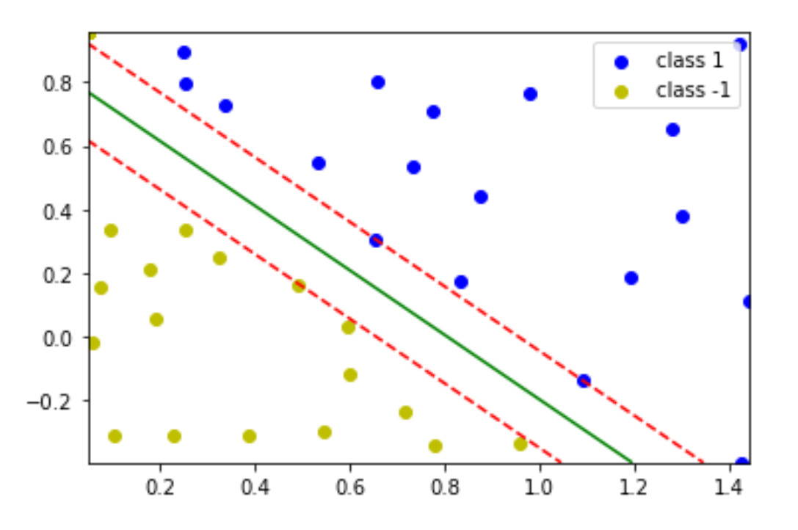
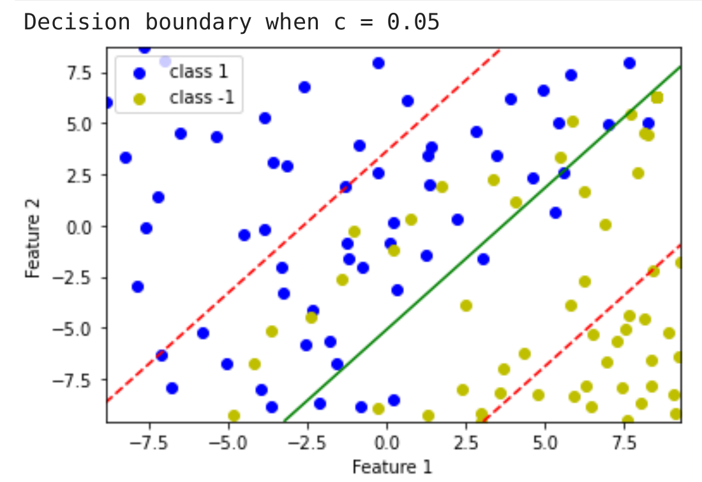

## Machine Learning and Artificial Intelligence for Engineers
This repo contains codes and results of all 5 assignments for this course. To view detailed results view the .pdf file inside folders
The course covers topics namely:
* Introduction to Machine Learning and Supervised Learning
* Regression
* Parametric/Non Parametric Learning
* Discriminative and Generative Algorithms
* Naive Bayes, Non‐linear Classifiers
* Feature Engineering/Representation
* Ensemble Methods
* Support Vector Machine (SVM)
* Unsupervised Learning and Clustering Algorithms
* Principal Component Analysis
* Neural Networks
* Training, Testing and Evaluation
* Reinforcement Learning

The assignment covers the following topics
1. Assignment 1: Introduction to Python (NumPy), Maximum Likelihood Estimation
2. Assignment 2: Linear Regression, Logistic Regression

3. Assignment 3: Naive Bayes, Regularization

Images before and after regularization

4. Assignment 4: PCA, Decision Trees, K-means and Neural Networks

Decision Tree classification Boundary

Results of k-means clustering

5. Assignment 5: SVM and k-fold validation

Hard Margin SVM for Linearly separable data

Soft Margin SVM for Linearly inseparable data
