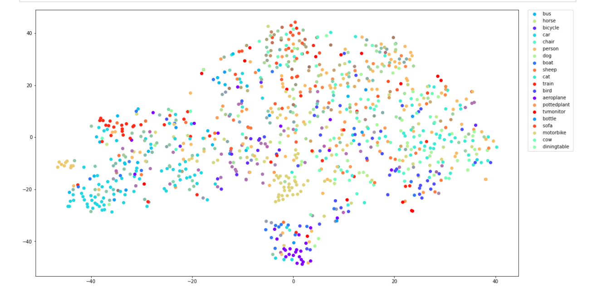
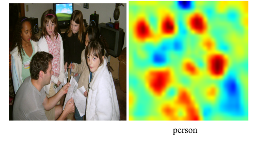
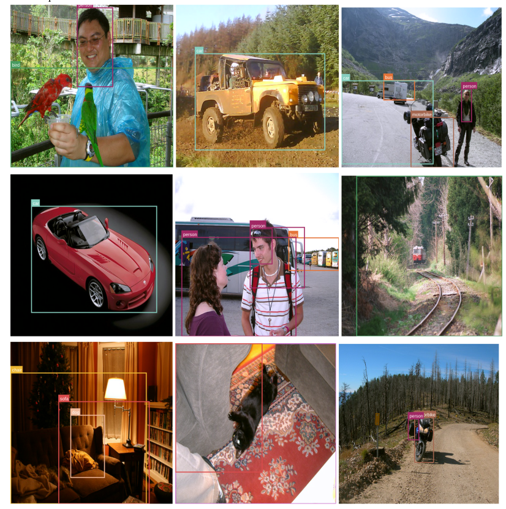
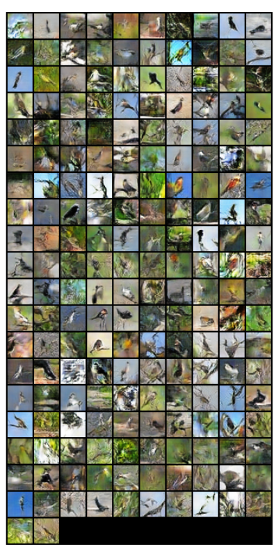
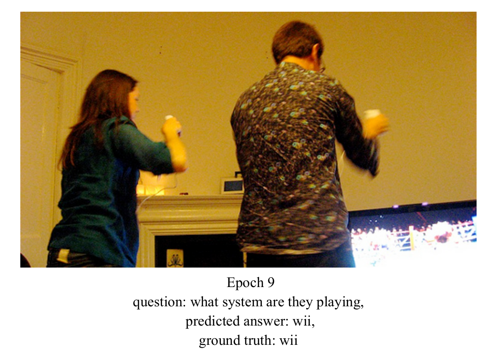

# Visual Learning and Recognition
## This course covers the following concepts
1. Visual Recognition 
2. Deep Learning
3. Image Classification
4. Object Detection
5. Video Understanding
5. 3D Scene Understanding
6. Generative Models for Images and Videos.
Some results of assignments

### 1. Neural Network Understanding

 TSNE projection of feature vector of CaffeNet on PASCAL data

### 2. Object Detection

 Heatmap of feature vector based on Resnet encoder for object detection

 Weakly Supervised Object detection results on PASCAL data with Alexnet encoder

### 3. GAN

 Results of bird images generated by Wasserstein Generative Adversarial Networks

### 3. Visual Question Answering

 Results of visual question answering using coattention between images and text on COCO dataset

